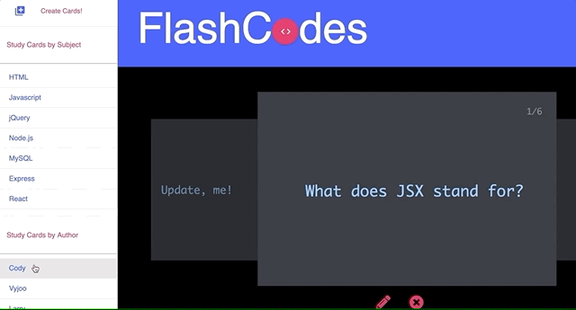

# FLASHCODES 

https://flashcodes.herokuapp.com/

>FlashCodes is an online study resource that helps students learn coding concepts quickly with the help of interactive flashcards.

## Table of contents

* [General info](#general-info)
* [Features](#features)
* [Technologies](#technologies)

## General info

Flashcodes is an online study resource that helps students learn coding concepts quickly with the help of interactive flashcards. Thanks to our interactive study community, users have generated content about need-to-know terminology, interview questions and code snippets complete with definitions and answers. We have material on many topics including HTML, CSS, Javascript, SQL, and more! Traditional study materials such as online articles and textbooks are helpful, but don’t help you retain information and recall for later use. With the help of FlashCodes, you can boost your coding knowledge and become a better developer today!
## Features
### Review Flash Cards
* The FlashCodes card engine makes it easy to flip through and study individual cards.
* The carousel is fully touch responsive for mobile use.

### Create New Cards
* Creating new cards is quick and easy. Simply hit the "Create Cards" button at the top of the screen, select a category for the card, and fill out the question, answer, and author fields.

### Update or Delete Existing Cards
* Hit the update card button located at the button of the screen to fix a mistake or modify an answer.
* Hit the delete button to remove a card entirely. A modal will appear, asking you to confirm.

### Filter Cards by Subject or Author
* If you want to study one subject on FlashCodes, simply hit the subject heading on the menu bar to the left.
* If you'd rather review only the cards you've made yourself, you can filter cards by author on the bottom left.

## Technologies

* [Node.js](https://nodejs.org/)- event I/O for the backend
* [JavaScript](https://www.javascript.com/)
* [Materialize](https://materializecss.com/) - UI Framework for this project
* [NPM](https://www.npmjs.com/) - Package manager
* [Express](https://www.expressjs.com/) - Server management
* [Agile](https://www.agile.com/)
* [Sequelize](https://www.sequilize.com/) - ORM for SQL Management
* [MySql](https://www.mysql.com/) - SQL Format
